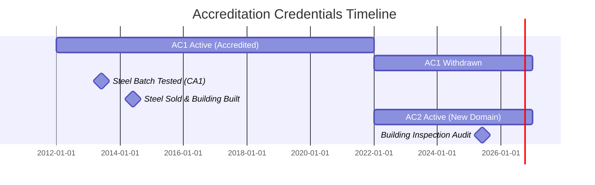
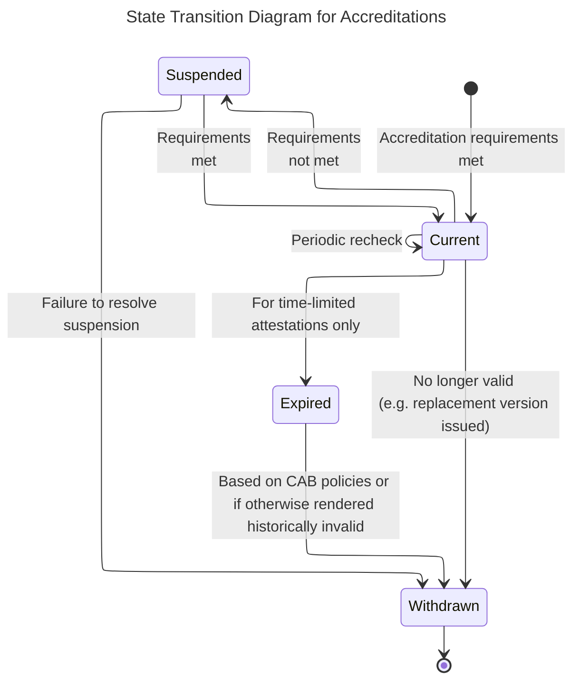
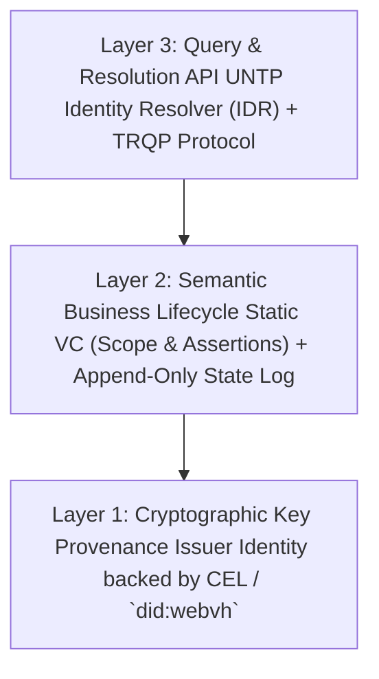
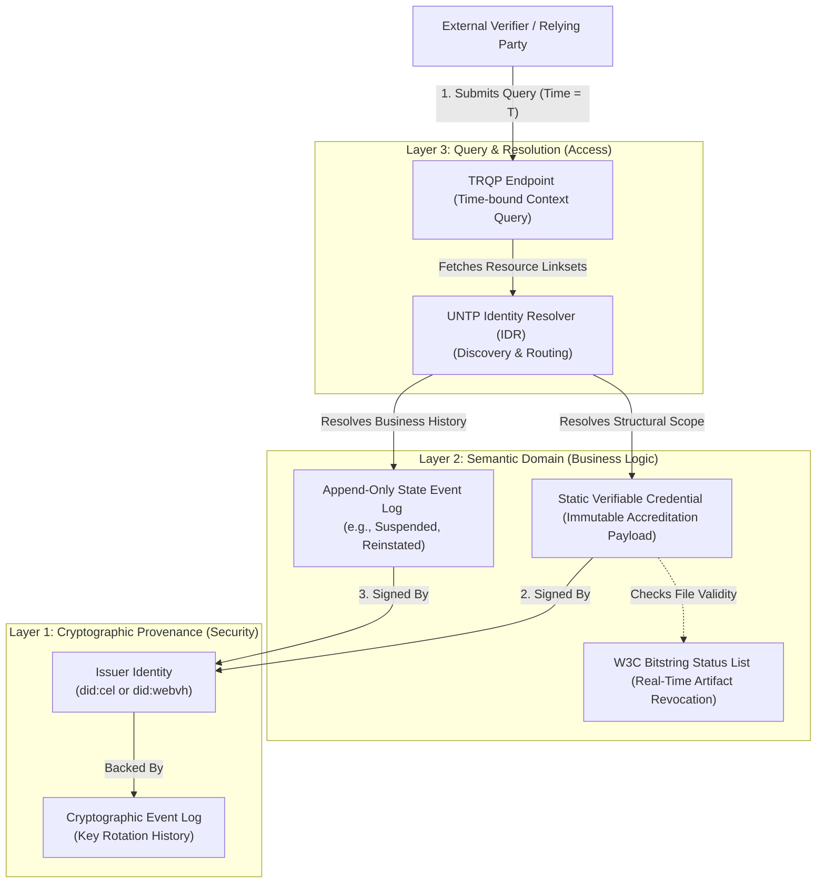

> **Superceded**
>
> A revised consideration of how best to solve this design challenge has been developed, [here](lifeCycleV3.md)
{: .warning }

# Beyond 'Right Now': Managing Credential Lifecycle History in the UNTP Ecosystem

> An earlier draft of this work constrained the potential solution space to the elements already defined in the UNTP Specification 0.7. That work can be found here: [UNTP_IDR_Enabled-lifeCycle.md](UNTP_IDR_Enabled-lifeCycle.md)
{: .note }

## Introduction

This document explores how we might satisfy both current and historical queries about verified credentials. The  catalyst for this exploration is the work of the UN/CEFACT projects on global supply chain transparency, and in particular the UNTP[^1] and GRID[^11] projects. The start of this paper originated in discussions on lifecycle management for accreditation credentials issued by Accreditation Bodies (ABs) to Conformity Assessment Bodies (CABs), such as testing laboratories.

However the intent is that the approach identified should work in all areas where understanding the history and status of a verifiable credential and its issuer is important. 

Specifically, this paper considers how we might answer point-in-time historical questions such as:

- **"Was Product X tested to Standard Y by a lab accredited to test it in Year Z?"**
- **"Was Organization X registered by an authoritative registrar of Country Y in Year Z?"**

---

## Use Case

We can use a construction supply chain example to create a use case that will allow us to explore the issues. Here we are using conformancy testing and application of tested products (steel) to build a supply chain use case. Our story starts in 2012:

1. **Year 01 (2012):** An Accreditation Body (AB) accredits a Testing Facility (TF) that performs steel testing. The accreditation receives a unique reference, **AC1**.
   * *UNTP Model:* The accreditation is issued as a **Digital Identity Anchor (DIA)**.<br>
   
2. **Year 02 (2013):** A Steel Manufacturer (SM) produces a green steel batch (**GREEN001**) and submits it to the Testing Facility. The facility issues a positive conformity assessment (**CA1**) confirming GREEN001 meets reinforced building steel standards.
   * *UNTP Model:* The conformity assessment is issued as a **Digital Conformity Credential (DCC)**.<br>

3. **Year 03 (2014):** The Steel Manufacturer sells the batch of GREEN001 steel to a Prime Contractor (PC), who uses it to construct an office building (**B1**).
   * *UNTP Model:* A **Digital Product Passport (DPP)** is issued and referenced in delivery documentation and on-product labeling (e.g., QR codes).<br>

4. **Year 10 (2021):** The Testing Facility shifts its business focus away from steel testing. Accreditation **AC1** is voluntarily withdrawn. In Year 11 (2022), the facility successfully applies for a new accreditation, **AC2**, covering a different domain.<br>

5. **Year 14 (2025/2026):** A building inspector audits Building B1 to verify its "green" status. They need to confirm: *"Was the steel used in this building certified green steel? Who certified it, to what standards, and were they accredited by a recognized accreditation body **11 years ago** when the steel was tested?"*<br>

### Timeline Visualization



### The Historical Query Challenge
In long-lived product sectors like construction, changes in ownership or updated regulations frequently trigger historical audits. When locally held paper or digital records are incomplete, organizations must rely on manual, expert-led archival searches of the issuing registries. In some instances, original registry records may be checked to confirm if the local copies are accurate.

However for all but the most trivial of checks, the time at which events occured is important. Products take time to manufacture. Goods take time to ship. The state and scope of registrations, licences and certifications change over time as do their owners. Supply chains are complex meshes of independent but interconnected parties, with transactions and system updates occuring at their own points in time. The idea that we can "just" check the current status has always been a simplification.  

The opportunity With UNTP and associated UN/CEFACT projects, is to establish a trustworthy, transparent, and algorithmically (machine) derivable **verifiable history** so that we can better answer point in time (historical) queries and also more confidently answer current queries. Rather than relying on manual archival searches, we want to enable queries to be answered using cryptographically protected records issued by authoritative bodies.

## Prior Work

### Conformity Life Cycle
In this section "conformity" means the outcome of tests and checks that something meets some specified standard(s). In the general model, a national testing authority checks that a test lab (also known as a Conformity Assessment Body, or CAB) is capable of performing certain tests to certain standards. The testing authority _certifies_ the CAB as being able to perform a range of tests to these standards.

As defined by UNTP[^1]:

> Conformity assessment bodies (CABs) undertake assessments for the purpose of determining whether products, processes or organisations meet specified requirements. The joint UNIDO/ISO publication Building Trust - The Conformity Assessment Toolbox represents a useful resource for understanding conformity assessment and its role in international trade.

The certification of CABs, and the conformity assessments issued by CABs have a lifecycle and point-in-time quality. There is the concept of "status" of the recognition of CABs and the assessments that they issue and that status may change over time.

The UN/CEFACT White Paper on Conformity Exchange[^2] notes that "digitalising status information in the context of conformity attestations warrants further investigation," emphasizing a key lifecycle principle:

> *"The issuer of the attestation [must] be recognised as retaining authority over the attestation, in order to provide certainty over the state (e.g., withdrawal, amendment, expiry) of an attestation over its valid lifetime."*

While Section 6.5.6 of the UN/CEFACT Business Requirements Specification (BRS)[^3] discusses attestation status, it does not define mechanisms for historical time-based queries. Annex 5 of the BRS presents the standard state transition lifecycle (the periodic recheck process has been added to this representation):



When evaluating this lifecycle against historical queries in 2026, two key operational barriers arise:

1. **Current-State Bias:** Registries typically display only the present status of a credential. In 2026, AC1 shows as Withdrawn and AC2 shows as Current. Without historical timestamps for each state transition, verifiers cannot prove whether AC1 was active when the steel was tested in 2013.

2. **Data Retention Limits:** Issuers are not always legally required or technically configured to publish full historical logs. Registries may only retain records for statutory periods (e.g., 7 years) or display only recent activity.

### W3C VC status representation

The W3C Verifiable Credential Data Model[^12] introduces the **Bitstring Status List v1.0 specification**[^6] for managing `credentialStatus`. While many systems use a 1-bit status (representing a binary 0 = Active or 1 = Revoked), the specification supports multi-bit status allocations (`statusSize` > 1) to express complex states alongside a `statusMessage` array.

For example, a 2-bit status configuration and using the NATA defined states yields four discrete values:

| Bin (2 bits) | Hex | State | Description |
|:--------------- |:--------- |:------------- |:------|
| 00              | 0x0       | Active | The initially awarded state |           
| 01              | 0x1       | Suspended | Temporarily invalid |           
| 10              | 0x2       | Withdrawn |Lab chose to end accreditation      |
| 11              | 0x3       | Cancelled | NATA forcibly removed accreditation) |

This could be represented by a `credentialStatus.statusMessage` array as shown below (ignoring the explanation for each state provided above):

```json
"credentialStatus": {
  "type": "BitstringStatusListEntry",
  "statusSize": 2,
  "statusMessage": [
    { "status": "0x0", "message": "Active" },
    { "status": "0x1", "message": "Suspended" },
    { "status": "0x2", "message": "Withdrawn" },
    { "status": "0x3", "message": "Cancelled" }
  ]
}
```

**The Limitation of Bitstring Status for Historical Audits**

Bitstring status lists are designed to answer real-time queries: *"Is this credential valid right now?"*

Because a bitstring list is dynamically fetched at runtime, updating a bit position to reflect a current withdrawal overwrites the previous active status without leaving an inline historical trail inside the credential itself. Therefore, while bitstring status is effective for immediate revocation, it cannot independently resolve historical point-in-time queries.

In other words, a bistring status lists alone cannot satisfy our requirements for historical searches.

### Validity Periods and Credential Immutability
The UNTP architecture uses issuer-hosted storage rather than issued to holder wallets model. This means that an issuer could, theoretically, edit and resign a credential that they have previously issued, For example, a period of validity could be closed early by editing the original credential's `validUntil` field and re-signing the file.

However, **editing and re-signing issued credentials violates fundamental Verifiable Credential design principles and would introduce several problems:**

- **Immutability:** Verifiable Credentials are cryptographic assertions anchored to a specific moment in time. Altering payload contents changes the digital signature hash.

- **Verification Discrepancies:** Modifying a credential breaks downstream cached copies and invalidates stored Verifiable Presentations (VPs) held by third parties.

- **Alignment with Physical Conventions:** In the physical world, a paper certificate issued in 2012 remains an unalterable artifact of what was true on that date.

This means that if a credential was issued with a null `validUntil` field, that field should remain null, permanently. 

This means that historical state changes should be handled through some form of external resolution.

### Cryptographic Event Logs

A Cryptographic Event Log is an append-only data structure designed to securely record, manage, and verify changes to data in decentralized systems. Rather than relying on a centralized authority to maintain a database of historical states, a CEL utilizes cryptographic techniques to create a tamper-evident, hash-chained sequence of events. Every update is mathematically chained to the entry before it, ensuring that the full sequence of changes can be independently verified.

**The Problem CEL Solves**
Standard credential revocation mechanisms and basic Decentralized Identifier (DID) methods often overwrite previous data, providing only a current snapshot of an identity or resource. This vulnerability means an identity document can be silently rewritten, removing the evidence necessary to verify a historical signature.

CEL solves the specific problem of key management and identifier control over time. By maintaining an immutable history of key rotations and document updates, CEL allows a verifier to independently reconstruct an entity's DID document at any point in the past. This provides the cryptographic assurance required to trust a historical signature, ensuring that even if a current key is compromised, the historical record remains verifiable and immune to retroactive forgery.

**Implementation Examples**
Several emerging DID specifications implement the CEL architecture to establish verifiable history:

W3C CCG `did:cel`: The W3C Credentials Community Group is developing the core CEL specification alongside the did:cel method. This method supports the independent verification of DID document changes and offers extensibility for tracking modifications to other data types, all without requiring traditional blockchain solutions.

did:webvh (DID Web with Verifiable History): This specification enhances the standard did:web method by attaching a verifiable history log to a DID document hosted on an HTTPS domain. It introduces advanced security features, such as key pre-rotation—where an entity commits to their next signing key in advance to prevent unauthorized future rotations—and the use of independent witnesses who co-sign updates to prevent a single compromised party from altering the log.


## Towards a solution

Having described the problem we want to solve, and identified relevant prior work, we now move onto how we might answer our verifiable history challenge.

### Architectural Rules

An optimal architecture separates cryptographic provenance, semantic claims, and verification query routing into three distinct, interoperable layers. This approach leverages the key-management guarantees of Cryptographic Event Logs (CEL) while avoiding the operational overhead of re-issuing full Verifiable Credentials (VCs) for every minor status change.



#### 1. Foundation Layer: Key Provenance (did:cel / did:webvh)
- **Function**: Manages the issuer's identity, signing keys, and key rotations over time.  
- **Mechanism**: The issuing authority (e.g., NATA) utilizes a self-certifying DID method backed by a cryptographic event log (did:cel or did:webvh).   
- **Trust Guarantee**: When auditing an event from 10 years ago, a verifier can independently reconstruct the issuer's DID document at time $T$ to prove that the key used to sign a credential was validly authorized on that specific date.

#### 2. Domain Layer: Static Assertions + Signed Event-Sourced Lifecycle
- **Function**: Captures semantic claims and tracks state changes over time.   
- **Mechanism:**
  - Credential (Assertion): The issuing body issues an initial Accreditation VC (Digital Identity Anchor) containing the full, unalterable scope, capabilities, and standards. This payload remains permanently static and immutable.   
  - State Stream (Lifecycle Log): Rather than generating a full replacement VC or relying on an ephemeral Bitstring Status List, state transitions (SUSPEND, REINSTATE, WITHDRAW) are appended as lightweight, signed, hash-linked state events to an append-only log tied to the unique accreditation relationship ID.   
- **Trust Guarantee**: The status log is append-only and hash-chained. The state at time $T$ is calculated deterministically by evaluating the event log up to timestamp $T$.
#### 3 Access Layer: UNTP IDR Routing & TRQP Abstraction
- Function: Exposes a simple, standardized verification interface to external relying parties.   
- Mechanism: The UNTP Identity Resolver (IDR) links the primary resource identifier to both the static VC payload and the append-only state event stream. A Trust Registry Query Protocol (TRQP) wrapper accepts point-in-time queries (context.time = T).   
- Trust Guarantee: Relying parties (e.g., customs platforms, building inspectors) do not need to parse raw event logs manually; the query layer executes the "Latest-Before" logic over the verified state log and returns a simple authorization proof.   
- 
### Architectural Benefits
- Elegance (Separation of Concerns): Key rotation, semantic domain assertions, and operational status transitions are isolated into their respective layers rather than forced into a single credential payload.   
- Efficiency (Minimal Data Footprint): Appending a small, signed state-transition event (e.g., {"event": "SUSPEND", "timestamp": T, "reason": "nonconformity"}) requires significantly less storage and computational overhead than re-signing and re-hosting large structural VCs.   
- Trustworthiness (Deterministic Reconstruction): Historical verification does not rely on issuer trust at query time; it relies on mathematically verifying the hash-chain of key state events ($L_1$) and status state events ($L_2$) up to timestamp $T$.   



This optimized architecture integrates the strengths of both approaches while enforcing strict separation of concerns:
- Layer 3 (Query & Resolution): The verifier interacts via a TRQP endpoint, passing a specific historical timestamp ($T$). The UNTP IDR handles the discovery, routing the request to the correct underlying payloads.   
- Layer 2 (Semantic Domain & Status): The accreditation's scope and assertions are captured in a static, immutable Verifiable Credential. The semantic lifecycle of that accreditation (e.g., active, suspended, withdrawn) is tracked via a signed, append-only state event log independent of the core VC payload.   
- Layer 1 (Cryptographic Provenance): The issuer's DID is backed by a Cryptographic Event Log (such as did:cel), enabling the verifier to mathematically prove the issuer's key state at the historical timestamp $T$.   
- Artifact Revocation (Bitstring Status List): The W3C Bitstring Status List remains attached specifically to the Static VC. It is reserved exclusively for binary, real-time revocation of the digital file itself (e.g., if the credential was issued in error or compromised), separating file-level security from the resource's business lifecycle.   

---

# Appendix A - Possible future integration with TRQP?

The Trust over IP (ToIP) Foundation's **Trust Registry Query Protocol** (TRQP / TQRP v2.0)[^9] defines a standardized, read-only interface for querying registry states—acting effectively as a "DNS for Digital Trust."

TRQP standardizes two query patterns:

1. Authorization Queries: "Has Authority A authorized Entity B to perform Action X on Resource Y?"

2. Recognition Queries: "Does Authority X recognize Entity B as an authoritative registrar?"

## Temporal Context Handling in TRQP

TRQP v2.0 includes a standardized `context.time` parameter (formatted to RFC 3339)[^10]. Instead of requiring verifiers to manually parse IDR linksets, an external system can submit a time-bound authorization query directly to a TRQP endpoint:

```json
{
  "query_type": "authorization",
  "authority_id": "did:example:accreditation-body",
  "entity_id": "did:example:testing-facility",
  "action": "conformity-testing",
  "resource": "steel-certification",
  "context": {
    "time": "2013-06-01T00:00:00Z"
  }
}
```

### Coexistence of UNTP and TRQP

_NEED TO ADD MATERIAL HERE TO REPLACE SUPERCEDED CONTENT_

---
**References**

[^1]: UNTP Specification: https://untp.unece.org/

[^2]: UN/CEFACT White Paper on Conformity Exchange: https://unece.org/trade/documents/2024/07/session-documents/brs-digital-product-conformity-certificate-exchange-high

[^3]: UN/CEFACT BRS Digital Product Conformity Certificate Exchange: https://unece.org/sites/default/files/2024-07/BRS-DigitalProductConformityCertificateExchange.pdf

[^4]: UNTP Digital Identity Anchor Specification: https://untp.unece.org/docs/specification/DigitalIdentityAnchor

[^5]: UNTP Conformity Credential Specification: https://untp.unece.org/docs/specification/ConformityCredential

[^6]: W3C Bitstring Status List v1.0: https://www.w3.org/TR/vc-bitstring-status-list/

[^7]: UNTP Identity Resolver Specification: https://untp.unece.org/docs/specification/IdentityResolver

[^8]: UNTP IDR Versioned Targets: https://untp.unece.org/docs/specification/IdentityResolver#versioned-targets

[^9]: ToIP Trust Registry Query Protocol (TRQP v2.0): https://trustoverip.github.io/tswg-trust-registry-protocol/approved/

[^10]: Trust Over IP Foundation: https://trustoverip.org/

[^11]: Global Registry Information Directory - GRID: https://grid.unece.org

[^12]: W3C VC Data Model 2.0: https://www.w3.org/TR/vc-data-model-2.0/

[^13]: W3C did:cel Method v0.9: https://w3c-ccg.github.io/did-cel-spec/

[^14]: DIF did:webvh Method v1.0: https://identity.foundation/didwebvh/v1.0/