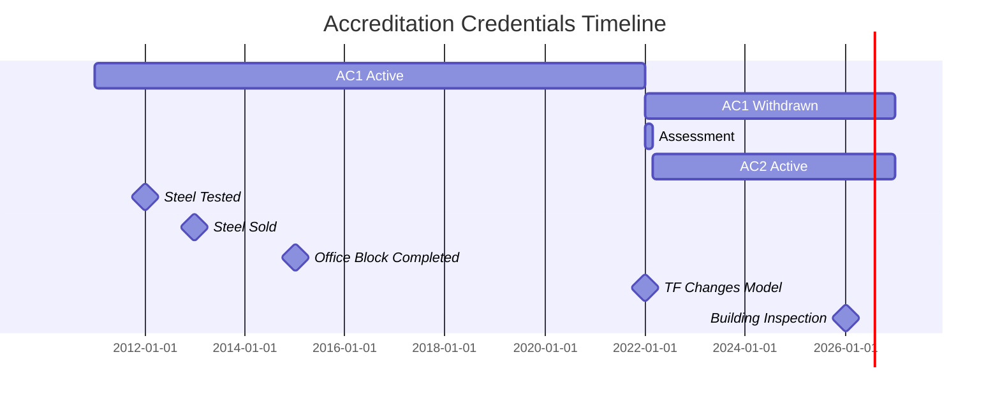
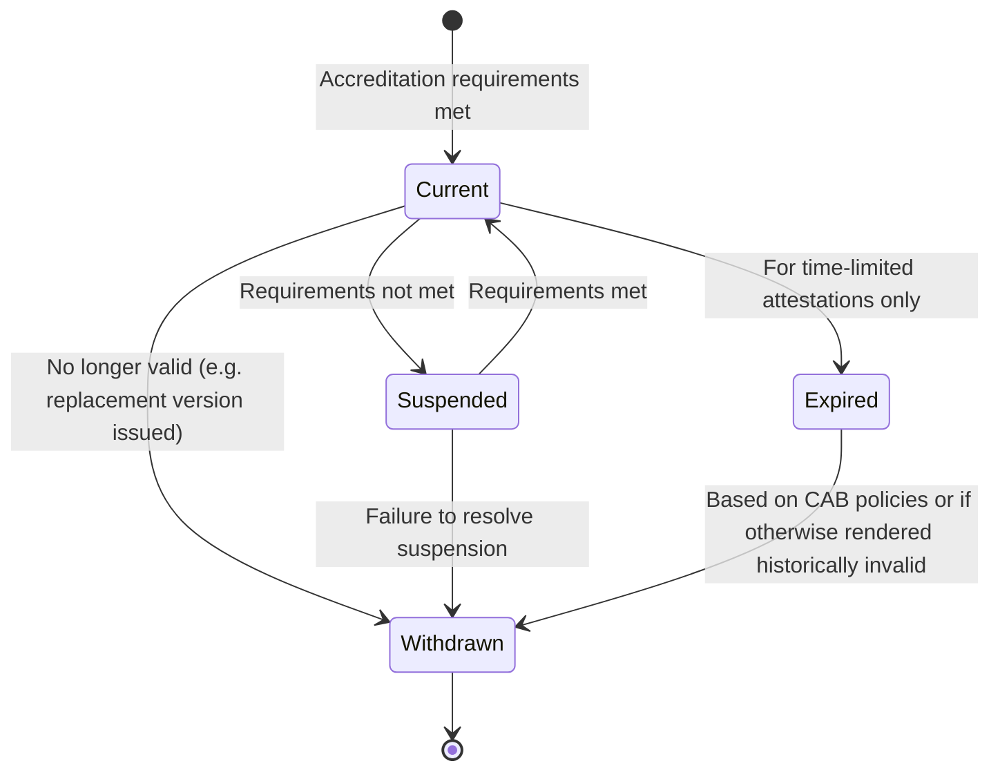
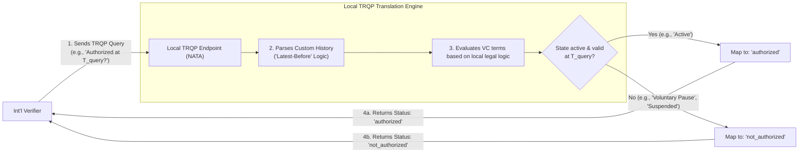

# Verifiable Credentials Status Over Time

Some mathemetical expressions aren't rendered neatly in the Jekyll rendered html page. Refer to the Markdown original if necessary.
{: .note }

## Introduction

The aim of this document is to explore how the elements defined in the UNTP specification[^10] can be used to satisfy both current and historical questions about accreditation credentials.

This document is focused on the topic of life cycle management for accreditation credentials issued by accreditation bodies to testing facilities (e.g. labs). This focus is used to simplify and give context to the discussion. We believe that the design principles presented here can be applied to other types of credentials and other contexts. 

Of particular interest is the design question: how might we use UNTP to determine **"was product X tested to standards Y by a lab accredited to test them, in year Z?"**

## Example

We'll use a simple model, but one that is expressive enough to be extended to other arrangements of regulators, accreditations bodies, global accreditations bodies, and conformity assessment bodies.

Our simple supply chain use case is as follows:

1. In Year-01, An Accreditation Body (AB) accredits a testing facility (TF) \- a lab for steel testing: the accreditation has a unique reference, "AC1". In UNTP terms, the accreditation is issued as a Digital Identity Anchor (DIA)
<br>

2. In Year-02, A Steel Manufacturer (SM) makes a green steel product, GREEN001, and gets a batch tested by the Testing Facility.
   
   2.1. The Testing Facility issues a (positive) conformity assessment (CA1) for GREEN001 against criteria that they are accredited to test against and that are applicable for GREEN001's intended use as a reinforced steel used in building. In UNTP terms, the conformity assessment is issued as a Digital Conformity Credential (DCC). 
<br>

3. In Year-03, the Steel Manufacturer sells a batch of the tested GREEN001 steel product to a customer, a prime contractor (PC) that uses it to build an office block (B1). In UNTP terms, a Digital Product Passport (DPP) would be issued and would be referenced in the delivery documentation and (possibly) through on-product labelling (e.g. QR code).
<br>

4. In Year-10 the Testing Facility changes business models and switches away from testing this type of steel. Its AC1 accreditation is withdrawn voluntarily and it applies, successfully, for new accreditation, AC2, in Year-11.
<br>

5. In Year-14, a new building inspector wants to know whether the building (B1) can genuinely claim its "green" status. They want to know: "Was the steel used in this building a certified green steel. If so, who certified it, to what standards, and were they accredited for that certification by a recognised accreditation body **11 YEARS AGO**.
<br>

If we consider these two accreditation certificates to be "AC1" and "AC2", and we make Year-01 equal "2012", we might draw a timeline as shown below:



This use case is reasonably common in the building sector. Changes to regulations and/or sales and transfer of ownership can mean that a building inspector needs to know what materials used and how the building was constructed. If the building records are uncertain or incomplete when changes in regulations occur (say), then the current practice is to explore these questions through a human expert led and supported initiative. Authoritative institutions and people are asked questions and evidence in the form of paper documents is gathered.

Revisiting our question: we want to explore whether, using UNTP, we can enable a trustworthy, transparent, **verifiable history**. We want the UNTP verifiable credentials to provide the same or greater confidence as the human expert response based on archival records. We want the result to be supported by cryptographically protected records issued by the authoritative body and, to the extent possible, the results be algorithmically determinable.

## Prior work \- Conformity Exchange

Section 4.2 of the UN/CEFACT white paper on conformity exchange[^1] "Management of conformity lifecycle" proposes that "Digitalising status information in the context of conformity attestations warrants further investigation". It further proposes that

> Regardless, one important principle when dealing with management of conformity data lifecycle is that the issuer of the attestation be recognised as retaining authority over the attestation, in order to provide certainty over the state (e.g., withdrawal, amendment, expiry) of an attestation over its valid lifetime.

Absent from the discussion in this section is a consideration of how to manage and present historical data.

Section 6.5.6 of the UN/CEFACT Business Requirements Specification (BRS) "Digital Product Conformity Certificate Exchange"[^2] discusses Attestation Status. Again, absent from this section is a consideration of historic values.

Annex 5 of the same document contains a life cycle diagram as a state transition diagram. The diagram is reproduced below showing each state and the transitions between them:



If we consider our example use case, the credential issued 11 years ago goes from `Current` to `Withdrawn` 4 years ago when the certificate became no longer valid as the lab no longer performs the same tests on steel. However, at no time (in our example) is the certificate in a `Suspended` state. 

The operating practice of Accreditation Bodies is to display the current state of credentials. So in 2026, the status of AC1 would be `withdrawn` and AC2 would be `current`. Further, the information presented may be limited to the current state, the date on which that state was registered, and the original issued date. This means that it is not possible to determine when previous state changes ocurred and for how long the accreditation was in that state. 

Further, Accreditation bodies do not display the full history of all accreditations ever issued. Historical searches typically demand contacting the Accreditation Body directly. It is unlikely that an Accreditation Body search would provide more than the statutory (legally) specified range of history an may choose to only present a subset of this history, the last 5 years (say).

## UNTP Elements

The UNTP credential identified as the most suitable for use as an Accreditation Credential is the Digital Identity Anchor[^3].

The key elements of the specification of this credential for this discussion are:

- `validFrom`  
- `validUntil`  
- `credentialStatus`

The `validFrom` and `validUntil` fields are date fields. UNTP does not require either field to contain a value (they are not mandatory). The use of these fields is mapped to the Issuer's standard operating practice on issuing an Accreditation Credential.

A typical use pattern for an Accreditation Credential can be that the value of the `validFrom` field is set to the date on which accreditation is recognised, and the `validUntil` field is left blank (or "null") as the recognition does not have a preset expiry date.

The `credentialStatus` field uses the W3C VC `bitStringStatus` approach to managing credential status. We'll explore that in the next section and then return to the `validFrom` and `validUntil` fields.

### W3C VC status representation

The `bitStringStatus` field is a standard W3C Verifiable Credential Data Model construct[^4]. The controlling specification for the use of the `bitStringStatusList` is "Bitstring Status List v1.0, Privacy-preserving status information for Verifiable Credentials" W3C Recommendation 15 May 2025: [https://www.w3.org/TR/vc-bitstring-status-list/](https://www.w3.org/TR/vc-bitstring-status-list/).

Most implementations of the W3C VC Data Model use a single-bit status (on/off, valid/not valid, revoked/active etc.). The W3C standard allows for more than one bit to be used to represent the status of each issued credential by setting the `statusSize` value greater than 1. If the `statusSize` attribute is set to a value greater than 1 then the property `credentialStatus.statusMessage` MUST also be present and the number of status messages MUST equal the number of possible values. In other words, we can have more than a single binary value for status, but if we do, we must define what each value means.

For example, if we set `statusSize` to 2 bits for the status we get 4 possible states. So, we could have:

| Binary (2 bits) | Hex Value | NATA State and example cause                    |
|:--------------- |:--------- |:----------------------------------------------- |
| 00              | 0x0       | Active (The initially awarded state)            |
| 01              | 0x1       | Suspended (Temporarily invalid)                 |
| 10              | 0x2       | Withdrawn (Lab chose to end accreditation)      |
| 11              | 0x3       | Cancelled (NATA forcibly removed accreditation) |

This could be represented by a `credentialStatus.statusMessage` array as shown below (ignoring the explanation for each state provided above):

```json
[
  {
    "status": "0x0",
    "message": "Active"
  },
  {
    "status": "0x1",
    "message": "Suspended"
  },
  {
    "status": "0x2",
    "message": "Withdrawn"
  },
  {
    "status": "0x3",
    "message": "Cancelled"
  }
]
```

This begins to look attractive as a mechanism to manage credential status. **HOWEVER** it is important to remember that verifiable credentials are typically treated as immutable records once issued. Changing contents without re-signing breaks the signature. Changing contents and re-signing is typically treated as a new issued instance.

The `bitStringStatus` is designed to enable revocation by the issuer without altering the content of the VC. A typical instance given of its use is the _temporary_ suspension of something like a driving licence which might in a future date be reinstated.

This means that, in terms of temporal application, the `bitStringStatus` is designed to solve a "now" query - what is the status of this credential **now**? It is not intended to answer the question: what **was** the status of this credential in the past?

### Validity Periods: from and until

Returning to our use pattern for the `validFrom` and `validUntil` fields we might be tempted to update the `validUntil` field to specify a time bound limit for a credential that we have previously issued and that we now know has a specific end date. This is _technically_ possible because, in the UNTP model, the "issuer" retains control of the VC (keeps the record within their own controlled space rather than sending (issuing) it a remote "Holder" wallet outside of their control). Changing and re-signing is technically possible, but it not recommended.

As we noted before, changing the content of a VC breaks the W3C VC expectation that VCs are immutable records. As a side note, it also makes the digital experience differ from the existing physical experience when a physical (or PDF) copy of an accreditation credential would be sent to a Facility with the issue date and no expiry date. This would then be stored by the Facility and becomes, to an extent, an immutable record. 

Editing and re-signing also causes other headaches. In high-throughput environments (like custom border checkpoints or automated logistics gates), we should expect verifiers to cache hosted VCs to improve performance. If a VC payload is updated and resigned without changing the identifier, it will create cache-invalidation failures across distributed edge nodes in the ecosystem.

Basically, if we issued the credential with a blank `validUntil` field, it should stay blank.

The good news is that we don't need to edit and re-sign previously issued credentials, there are better design patterns to use. We can use other elements of the UNTP specification to provide this capability and adhere to the best practice of W3C VC use AND mirror the existing physical world pattern.

### UNTP Identity Resolver

The "Identity Resolver" (IDR) is a part of the UNTP Specification[^5]. An identity resolver is a web-based service that accepts a machine-readable identifier (like a barcode, QR code, URL, or decentralised identifier (DID)) and returns the data linked to it.

That means it "resolves" (or redirects) using the identifier value as an address to retrieve structured links to authoritative data sources. This enables systems, from handheld scanners to compliance platforms, to retrieve context-specific information for traceability, certification, regulatory reporting and more.

An identity resolver is not a registry or primary data store. It acts as a routing and resolution layer that connects identifiers to the systems or authorities that hold the relevant data.

The IDR enables the UNTP `discover → resolve → verify` workflow by returning verifiable data about the product, component, or facility associated with a given identifier. UNTP-aligned resolvers must support both:

- Registry-managed identifiers (e.g. Accreditation References, GTINs or location codes etc. assigned by authorities)  
- Self-assigned identifiers, such as DIDs (Decentralised Identifiers) controlled by the entity itself

For our discussion in this document, the critical capability of the UNTP IDR specification is that it supports version history[^6]. The example given in the UNTP specification at version `0.7.0` considers a Digital Product Passport, but the same approach can be used for other UNTP credentials. 

Returning to our use case above, this means that a query on the Accreditation held by the Testing Facility (TF) will return the current credential (AC2) and, *if requested*, the full history of previous credentials, including AC1.

Expanding on this logic further: because in the context of Accreditations "Suspended" or "Withdrawn" are explicit legal changes, we must cryptographically sign a new statement. We cannot represent a suspension simply by deleting the old VC; we must issue a new record where the credentialSubject.status explicitly equals "Suspended".

We can explore how this might work from an algorithmic test point of view.

When a verifier queries the Identity Resolver (IDR) for historical date ($T_{\text{query}}$), the resolver must execute a "Latest-Before" optimization logic test as follows:

1. Gather the complete collection of VCs issued by the Accreditation Body for the specific Facility identifier.

2. Filter the collection to include only VCs where:

$$
T_{\text{validFrom}} \le T_{\text{query}}
$$

3. From that filtered subset, select the single VC that possesses the maximum validFrom timestamp:

$$
\text{Target VC} = \text{argmax}_{VC} \{ VC.validFrom \mid VC.validFrom \le T_{\text{query}} \}
$$


## Conclusion - all states considered

The following is proposed:

1. Reserve the `credentialStatus` setting for the whole of life status value setting and changes. The default is to use two states: `active` and `revoked`.

2. Do not delete or edit issued credentials.

3. Issue a new credential when a change of status occurs.

4. Support verifiers who need to know past values by using IDR to generate a linkset of previous credentials.


---

# Appendix A \- Possible future integration with TRQP?

This section considers the possibility of using "TRQP" with UNTP. Consider it a thought experiment...

TRQP is the "Trust Registry Query Protocol"[^9]. It is a specification developed by the Trust Over IP project within the Linux Decentralized Trust Foundation[^10]. Quoting from its introduction:

> TRQP focuses on two query types:
>
> 1. Authorization Queries: “Has Authority A authorized Entity B to take Action X on Resource Y?”
> 2. Recognition Queries: "Does Authority X recognize Entity B as an authority to authorize taking Action X on Resource Y?”

Our question at the beginning of this document "was product X tested to standards Y by a lab accredited to test them in year Z?" can be seen to be very similar to the type of questions that TRQP seeks to address. It can also be seen to have applicability to the UN/CEFACT GRID project, which focuses on Authoritative Registrars and their Registers. For now, we'll stick with our credential status life cycle focus.

So might we consider using the Trust over IP (ToIP) **Trust Registry Query Protocol (TRQP / TQRP) v2.0**[^7] with UNTP? Would that be a good addition?

TRQP describes itself as the **"DNS for digital trust,"**. It is designed as a lightweight, read-only query protocol that enables queries across heterogeneous governance models using a standard protocol.

Bringing TRQP into the UNTP landscape can add value to our temporal discovery challenge.

TRQP v2.0 includes an **Extensibility Context Object**. The specification states that if a context object needs to express a time-based condition, it MUST use a standardized `time` parameter formatted to RFC 3339\.

This means that instead of a bespoke processing on the IDR response, a time-based query routed via TRQP looks like this:

```json
{
  "query_type": "authorization",
  "authority_id": "did:example:national-registrar",
  "entity_id": "did:example:enterprise-x",
  "action": "transact",
  "resource": "eu-border-clearance",
  "context": {
    "time": "2016-07-17T11:26:25Z"
  }
}
```

The TRQP endpoint processes the query, evaluates the historical states (interacting with the UNTP IDR log layer), and returns a standardized trust status (`authorized`, `not_authorized`, say) for the requested moment in time.

### How UNTP IDR and TRQP Might Coexist

TRQP would not replace the UNTP Identity Resolver (IDR) or the core Digital Identity Anchor (DIA) structures; rather, it would act as an **API interoperability surface** wrapped around them.

The diagram below shows how the flow could work.





### Architectural Alignment

By implementing a **UNTP Profile for TRQP**, we can achieve additional benefits for UNTP users. TRQP can act as an alternative query path. External software platforms (like corporate ERPs, banks, and customs systems) do not need to understand the internal mechanics of the UNTP IDR or parse complex JSON schemas natively. They use a standard, read-only TRQP query to the registry surface. The registry uses its internal UNTP IDR routing infrastructure to evaluate immutable, issuer-controlled VCs over a historical graph timeline - returning a simple, safe, and cryptographically sound response.

---

[^1]: [https://unece.org/trade/documents/2024/07/session-documents/brs-digital-product-conformity-certificate-exchange-high](https://unece.org/trade/documents/2024/07/session-documents/brs-digital-product-conformity-certificate-exchange-high)

[^2]: [https://unece.org/sites/default/files/2024-07/BRS-DigitalProductConformityCertificateExchange.pdf](https://unece.org/sites/default/files/2024-07/BRS-DigitalProductConformityCertificateExchange.pdf)

[^3]: [https://untp.unece.org/docs/specification/DigitalIdentityAnchor](https://untp.unece.org/docs/specification/DigitalIdentityAnchor)

[^4]: [https://www.w3.org/TR/vc-data-model-2.0/](https://www.w3.org/TR/vc-data-model-2.0/)

[^5]: [https://untp.unece.org/docs/specification/IdentityResolver](https://untp.unece.org/docs/specification/IdentityResolver), see also [https://kb.pyx.io/docs/Development/idresolver/](https://kb.pyx.io/docs/Development/idresolver/)

[^6]: [https://untp.unece.org/docs/specification/IdentityResolver\#versioned-targets](https://untp.unece.org/docs/specification/IdentityResolver#versioned-targets)

[^7]: [https://trustoverip.github.io/tswg-trust-registry-protocol/approved/](https://trustoverip.github.io/tswg-trust-registry-protocol/approved/)

[^8]: https://trustoverip.github.io/tswg-trust-registry-protocol/approved/

[^9]: https://trustoverip.org/

[^10]: https://untp.unece.org/