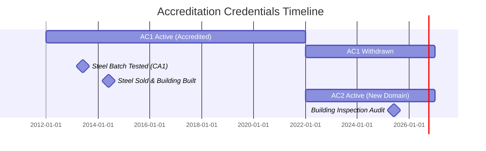
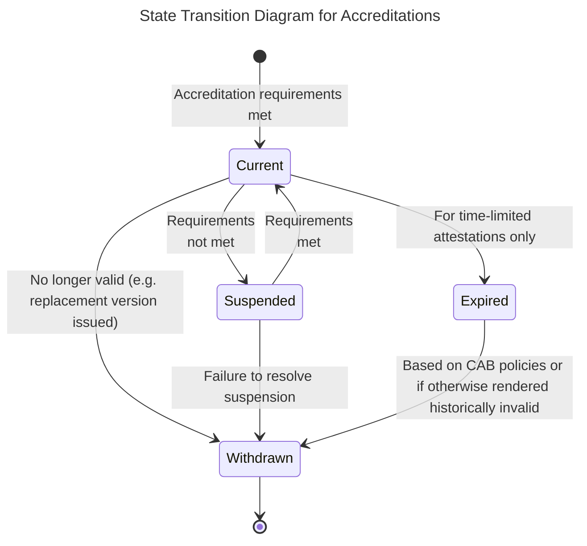
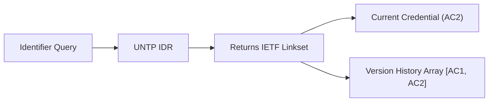
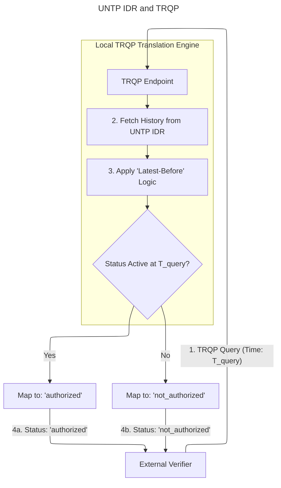

# Verifiable Credentials Status History

## Introduction

This document explores how elements defined in the UN Transparency Protocol (UNTP) specification[^1] satisfy both current and historical queries about issued credentials.

This paper originated from discussions on lifecycle management for accreditation credentials issued by Accreditation Bodies (ABs) to Conformity Assessment Bodies (CABs), such as testing laboratories. The design principles presented here apply broadly across credential types and domain contexts.

Specifically, this paper demonstrates how the UNTP framework - which specifies data structures for Verifiable Credentials (VCs) as well as operational models for discovery, resolution, and verification - answers point-in-time historical questions such as:
- **"Was Product X tested to Standard Y by a lab accredited to test it in Year Z?"**
- **"Was Organization X registered by an authoritative registrar of Country Y in Year Z?"**

---

## Example Scenario: The Green Steel Supply Chain

Consider the following multi-year supply chain lifecycle:

1. **Year 01 (2012):** An Accreditation Body (AB) accredits a Testing Facility (TF) that performs steel testing. The accreditation receives a unique reference, **AC1**.
   * *UNTP Model:* The accreditation is issued as a **Digital Identity Anchor (DIA)**.
2. **Year 02 (2013):** A Steel Manufacturer (SM) produces a green steel batch (**GREEN001**) and submits it to the Testing Facility. The facility issues a positive conformity assessment (**CA1**) confirming GREEN001 meets reinforced building steel standards.
   * *UNTP Model:* The conformity assessment is issued as a **Digital Conformity Credential (DCC)**.
3. **Year 03 (2014):** The Steel Manufacturer sells the batch of GREEN001 steel to a Prime Contractor (PC), who uses it to construct an office building (**B1**).
   * *UNTP Model:* A **Digital Product Passport (DPP)** is issued and referenced in delivery documentation and on-product labeling (e.g., QR codes).
4. **Year 10 (2021):** The Testing Facility shifts its business focus away from steel testing. Accreditation **AC1** is voluntarily withdrawn. In Year 11 (2022), the facility successfully applies for a new accreditation, **AC2**, covering a different domain.
5. **Year 14 (2025/2026):** A building inspector audits Building B1 to verify its "green" status. They need to confirm: *"Was the steel used in this building certified green steel? Who certified it, to what standards, and were they accredited by a recognized accreditation body **11 years ago** when the steel was tested?"*

### Timeline Visualization


```mermaid
gantt
    title Accreditation Credentials Timeline
    dateFormat YYYY-MM-DD
    AC1 Active (Accredited)       :ac1a, 2012-01-01, 2021-12-31
    AC1 Withdrawn                 :ac1w, 2022-01-01, 2026-12-31 
    Steel Batch Tested (CA1)      :milestone, 2013-06-01, 0d
    Steel Sold & Building Built   :milestone, 2014-06-01, 0d 
    AC2 Active (New Domain)       :ac2a, 2022-01-01, 2026-12-31
    Building Inspection Audit     :milestone, 2025-06-01, 0d
```

### The Historical Query Challenge
In sectors like construction, changes in ownership or updated regulations frequently trigger historical audits. When paper or digital records are incomplete, organizations must rely on manual, expert-led archival searches.

Using UNTP, we can establish a trustworthy, transparent, **verifiable history**. Rather than relying on manual archival searches, queries can be determined algorithmically using cryptographically protected records issued directly by authoritative bodies.

## Prior Work: Conformity Exchange
The UN/CEFACT White Paper on Conformity Exchange[^2] notes that "digitalising status information in the context of conformity attestations warrants further investigation," emphasizing a key lifecycle principle:

> *"The issuer of the attestation [must] be recognised as retaining authority over the attestation, in order to provide certainty over the state (e.g., withdrawal, amendment, expiry) of an attestation over its valid lifetime."*

While Section 6.5.6 of the UN/CEFACT Business Requirements Specification (BRS)[^3] discusses attestation status, it does not define mechanisms for historical time-based queries. Annex 5 of the BRS presents the standard state transition lifecycle:


```mermaid
---
title: State Transition Diagram for Accreditations
---
stateDiagram
  direction TB
  [*] --> Current:Accreditation requirements met
  Current --> Suspended:Requirements</br>not met
  Current --> Withdrawn:No longer valid (e.g. replacement version issued)
  Current --> Expired:For time-limited attestations only
  Suspended --> Current:Requirements</br>met
  Suspended --> Withdrawn:Failure to resolve suspension
  Expired --> Withdrawn:Based on CAB policies or <br/>if otherwise rendered historically invalid
  Withdrawn --> [*]
```

When evaluating this lifecycle against historical queries in 2026, two key operational barriers arise:

1. **Current-State Bias:** Registries typically display only the present status of a credential. In 2026, AC1 shows as Withdrawn and AC2 shows as Current. Without historical timestamps for each state transition, verifiers cannot prove whether AC1 was active when the steel was tested in 2013.

2. **Data Retention Limits:** Issuers are not always legally required or technically configured to publish full historical logs. Registries may only retain records for statutory periods (e.g., 7 years) or display only recent activity.

## UNTP Core Elements

In the UNTP framework, accreditation is modeled by an Accreditation Body issuing a **Digital Identity Anchor (DIA)**[^4] to a Conformity Assessment Body (CAB). The accredited CAB then issues **Digital Conformity Credentials (DCCs)**[^5] to products or organizations meeting specified standards.

Both DIAs and DCCs contain three key validity properties:

- `validFrom` (ISO timestamp)

- `validUntil` (ISO timestamp)

- `credentialStatus` (Status definition object)

The `validFrom` and `validUntil` fields are optional. A standard operational pattern is to set `validFrom` to the recognition date while leaving `validUntil` null, as accreditations are typically open-ended until revoked or updated.

### W3C VC status representation

UNTP leverages the W3C **Bitstring Status List v1.0 specification**[^6] for managing `credentialStatus`. While many systems use a 1-bit status (representing a binary 0 = Active or 1 = Revoked), the specification supports multi-bit status allocations (`statusSize` > 1) to express complex states alongside a `statusMessage` array.

For example, a 2-bit status configuration yields four discrete states:

| Bin (2 bits) | Hex | State | Description |
|:--------------- |:--------- |:------------- |:------|
| 00              | 0x0       | Active | The initially awarded state |           
| 01              | 0x1       | Suspended | Temporarily invalid |           
| 10              | 0x2       | Withdrawn |Lab chose to end accreditation      |
| 11              | 0x3       | Cancelled | NATA forcibly removed accreditation) |

This could be represented by a `credentialStatus.statusMessage` array as shown below (ignoring the explanation for each state provided above):

```json
"credentialStatus": {
  "type": "BitstringStatusListEntry",
  "statusSize": 2,
  "statusMessage": [
    { "status": "0x0", "message": "Active" },
    { "status": "0x1", "message": "Suspended" },
    { "status": "0x2", "message": "Withdrawn" },
    { "status": "0x3", "message": "Cancelled" }
  ]
}
```
### The Limitation of Bitstring Status for Historical Audits

Bitstring status lists are designed to answer real-time queries: *"Is this credential valid right now?"*

Because a bitstring list is dynamically fetched at runtime, updating a bit position to reflect a current withdrawal overwrites the previous active status without leaving an inline historical trail inside the credential itself. Therefore, while bitstring status is effective for immediate revocation, it cannot independently resolve historical point-in-time queries.

### Validity Periods and Credential Immutability
When a credential's operational status changes, an issuer might be tempted to edit the original credential's `validUntil` field and re-sign the file. Because the UNTP architecture uses issuer-hosted storage rather than holder-only wallets, editing a hosted file is technically possible.

However, **editing and re-signing issued credentials violates fundamental Verifiable Credential design principles:**

- **Immutability:** Verifiable Credentials are cryptographic assertions anchored to a specific moment in time. Altering payload contents changes the digital signature hash.

- **Verification Discrepancies:** Modifying a credential breaks downstream cached copies and invalidates stored Verifiable Presentations (VPs) held by third parties.

- **Alignment with Physical Conventions:** In the physical world, a paper certificate issued in 2012 remains an unalterable artifact of what was true on that date.

If a credential was issued with a null `validUntil` field, that file should remain permanently untouched. Historical state changes should be handled through external resolution layers.

## The UNTP Solution: The Identity Resolver (IDR)

The UNTP Identity Resolver (IDR)[^7] provides the necessary architectural capability. The IDR is a web-based service that accepts a machine-readable identifier (e.g., URI, GTIN, or Decentralized Identifier / DID) and returns an IETF Linkset directing the caller to authoritative data.

The IDR enables the UNTP `Discover → Resolve → Verify` workflow and natively supports versioned targets[^8].


```mermaid
flowchart LR
    A["Identifier Query"] --> B["UNTP IDR"]
    B --> C["Returns IETF Linkset"]
    C --> D["Current Credential (AC2)"]
    C --> E["Version History Array [AC1, AC2]"]
```

### State Transitions as New Signed Artifacts

When a facility's accreditation status changes (e.g., from Active to Suspended or Withdrawn), the issuer creates and cryptographically signs a **new credential record** detailing the new state and its `validFrom` timestamp.

The historical timeline is managed by appending the new credential to the IDR's version history linkset without altering or deleting the previous records.

### The "Latest-Before" Algorithimic Lookup

When a verifier queries the Identity Resolver for the status of an entity at a specific past timestamp ($T_{\text{query}}$), the resolver applies a Latest-Before selection algorithm:

1. **Retrieve Collection:** Gather all VCs issued for the target facility identifier:

$$\text{CompleteSet} = \{ VC_1, VC_2, \dots, VC_n \}$$

2. **Filter by Start Timestamp:** Filter the collection to include only credentials issued on or before the target date:

$$\text{FilteredSet} = \{ VC \in \text{CompleteSet} \mid VC.\text{validFrom} \le T_{\text{query}} \}$$

3. **Select Target Instance:** From the filtered subset, select the single credential possessing the maximum validFrom timestamp:

$$VC_{\text{target}} = \arg\max_{VC \in \text{FilteredSet}} (VC.\text{validFrom})$$

The resulting $VC_{\text{target}}$ represents the exact operational status active at timestamp $T_{\text{query}}$.

## Conclusion & Architectural Rules

To deliver a cryptographically verifiable history while respecting W3C standards, UNTP implementations should adhere to four core design rules:

1. **Use Bitstring Status for Real-Time State:** Restrict `credentialStatus` bitstring checks to binary, real-time queries (*"Is this valid right now?"*).

2. **Preserve Credential Immutability:** Never edit, overwrite, or re-sign previously issued credentials.

3. **Issue New Credentials for State Changes:** Treat every status change (Active, Suspended, Withdrawn) as a distinct, cryptographically signed event with a new `validFrom` timestamp.

4. **Leverage the IDR for Historical Traversal:** Use the UNTP Identity Resolver to host versioned linksets, enabling verifiers to deterministically reconstruct historical trust graphs using the "Latest-Before" algorithm.

---

# Appendix A \- Possible future integration with TRQP?

The Trust over IP (ToIP) Foundation's **Trust Registry Query Protocol** (TRQP / TQRP v2.0)[^9] defines a standardized, read-only interface for querying registry states—acting effectively as a "DNS for Digital Trust."

TRQP standardizes two query patterns:

1. Authorization Queries: "Has Authority A authorized Entity B to perform Action X on Resource Y?"

2. Recognition Queries: "Does Authority X recognize Entity B as an authoritative registrar?"

## Temporal Context Handling in TRQP

TRQP v2.0 includes a standardized `context.time` parameter (formatted to RFC 3339)[^10]. Instead of requiring verifiers to manually parse IDR linksets, an external system can submit a time-bound authorization query directly to a TRQP endpoint:

```json
{
  "query_type": "authorization",
  "authority_id": "did:example:accreditation-body",
  "entity_id": "did:example:testing-facility",
  "action": "conformity-testing",
  "resource": "steel-certification",
  "context": {
    "time": "2013-06-01T00:00:00Z"
  }
}
```

### Coexistence of UNTP IDR and TRQP

TRQP does not replace the UNTP IDR; rather, it acts as an interoperability wrapper around the IDR resolution engine:



```mermaid
---
config:
  layout: elk
title: UNTP IDR and TRQP
---
flowchart TD
    A["External Verifier"] -->|"1. TRQP Query (Time: T_query)"| B["TRQP Endpoint"]
    
    subgraph Translation ["Local TRQP Translation Engine"]
        B --> C["2. Fetch History from UNTP IDR"]
        C --> D["3. Apply 'Latest-Before' Logic"]
        D --> E{"Status Active at T_query?"}
    end
    
    E -->|"Yes"| F["Map to: 'authorized'"]
    E -->|"No"| G["Map to: 'not_authorized'"]

    F -->|"4a. Status: 'authorized'"| A
    G -->|"4b. Status: 'not_authorized'"| A
```


By placing a TRQP interface in front of the UNTP IDR, external systems (such as customs platforms or trade finance applications) can execute historical audits without needing to parse custom JSON schemas or manually evaluate credential linksets.

---
**References**

[^1]: UNTP Specification: https://untp.unece.org/

[^2]: UN/CEFACT White Paper on Conformity Exchange: https://unece.org/trade/documents/2024/07/session-documents/brs-digital-product-conformity-certificate-exchange-high

[^3]: UN/CEFACT BRS Digital Product Conformity Certificate Exchange: https://unece.org/sites/default/files/2024-07/BRS-DigitalProductConformityCertificateExchange.pdf

[^4]: UNTP Digital Identity Anchor Specification: https://untp.unece.org/docs/specification/DigitalIdentityAnchor

[^5]: UNTP Conformity Credential Specification: https://untp.unece.org/docs/specification/ConformityCredential

[^6]: W3C Bitstring Status List v1.0: https://www.w3.org/TR/vc-bitstring-status-list/

[^7]: UNTP Identity Resolver Specification: https://untp.unece.org/docs/specification/IdentityResolver

[^8]: UNTP IDR Versioned Targets: https://untp.unece.org/docs/specification/IdentityResolver#versioned-targets

[^9]: ToIP Trust Registry Query Protocol (TRQP v2.0): https://trustoverip.github.io/tswg-trust-registry-protocol/approved/

[^10]: Trust Over IP Foundation: https://trustoverip.org/